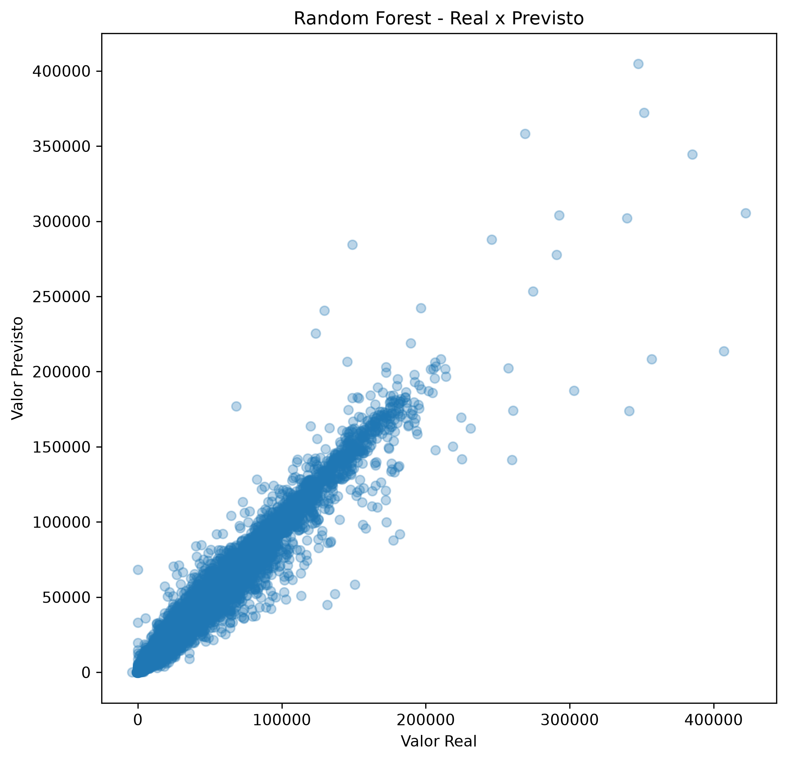
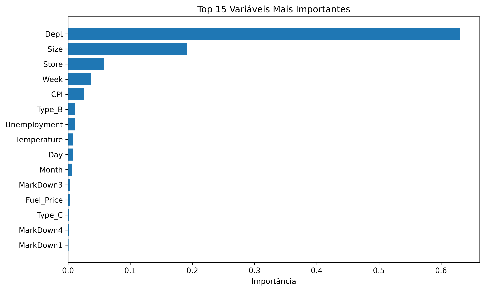

# Walmart Sales Forecasting


A Machine Learning project for predicting Walmart weekly sales using Exploratory Data Analysis (EDA), Feature Engineering, and Regression models.

---

# 📌 Project Overview

This project predicts Walmart's weekly sales using historical sales data, store information, and external economic indicators.

The complete Machine Learning pipeline was implemented, including:

- Data Understanding
- Data Cleaning
- Feature Engineering
- Exploratory Data Analysis (EDA)
- Model Training
- Model Evaluation
- Model Persistence
- Prediction on New Data

---

# 📂 Dataset

The project uses the **Walmart Sales Forecasting** dataset, composed of three files:

- `train.csv` → Historical weekly sales
- `features.csv` → Economic indicators and promotional information
- `stores.csv` → Store characteristics

The dataset contains variables such as:

- Weekly Sales
- Store ID
- Department
- Temperature
- Fuel Price
- CPI
- Unemployment Rate
- Holiday Weeks
- Promotional MarkDowns
- Store Type
- Store Size

---

# 🚀 Technologies Used

- Python 3.12
- Pandas
- NumPy
- Matplotlib
- Scikit-Learn
- Joblib
- Jupyter Notebook

---

# 📁 Project Structure

```text
sales-data-eda/
│
├── data/
│   ├── raw/
│   │   ├── train.csv
│   │   ├── features.csv
│   │   └── stores.csv
│   │
│   └── processed/
│       └── (generated after training)
│
├── images/
│   ├── random_forest_feature_importance.png
│   └── random_forest_real_vs_predicted.png
│
├── notebooks/
│   ├── 01_data_understanding.ipynb
│   ├── 02_model_training.ipynb
│   └── 03_inference.ipynb
│
├── src/
│
├── README.md
├── requirements.txt
├── LICENSE
└── .gitignore
```

---

# 📊 Exploratory Data Analysis

The exploratory analysis includes:

- Dataset overview
- Missing values analysis
- Weekly sales distribution
- Outlier detection
- Monthly sales analysis
- Holiday impact on sales
- Top-performing stores
- Store type comparison
- Store size analysis
- Correlation analysis
- Feature importance

Several visualizations were generated to better understand the data before training the models.

---

# ⚙️ Feature Engineering

New features created:

- Year
- Month
- Day
- Quarter
- Week
- DayOfWeek

Additional preprocessing steps:

- Merge of all datasets
- Missing values in MarkDown variables replaced with zero
- One-Hot Encoding for categorical variables

---

# 🤖 Machine Learning Models

Two regression models were evaluated.

## Linear Regression

Performance:

| Metric | Value |
|--------|-------:|
| MAE | 14,561.50 |
| RMSE | 21,753.61 |
| R² Score | 0.0925 |

---

## Random Forest Regressor

Performance:

| Metric | Value |
|--------|-------:|
| MAE | 1,332.36 |
| RMSE | 3,419.45 |
| R² Score | 0.9776 |

The Random Forest Regressor significantly outperformed Linear Regression and was selected as the final production model.

---

# 📈 Results

## Actual vs Predicted Values



---

## Feature Importance



---

# 💾 Model Persistence

The training notebook automatically generates:

```text
random_forest_model.pkl
model_columns.pkl
```

These files are intentionally excluded from version control because they are generated artifacts. They can be recreated at any time by running the training notebook.

---

# 🔮 Example Prediction

After loading the trained model, predictions can be generated using new store information.

Example output:

```text
Predicted Weekly Sales:
$158,852.76
```

---

# ▶️ How to Run

Clone the repository:

```bash
git clone https://github.com/JuanFerreira23/walmart-sales-forecasting.git
```

Enter the project folder:

```bash
cd walmart-sales-forecasting
```

Install the dependencies:

```bash
pip install -r requirements.txt
```

Run the notebooks in the following order:

1. `01_data_understanding.ipynb`
2. `02_model_training.ipynb`
3. `03_inference.ipynb`

---

# 📌 Future Improvements

- Hyperparameter tuning
- Cross-validation
- XGBoost implementation
- LightGBM implementation
- Model deployment using FastAPI
- Interactive dashboard with Streamlit

---

# 👨‍💻 Author

**Juan Rodrigues Ferreira**

Computer Science Student

GitHub:
https://github.com/JuanFerreira23

---

# 📄 License

This project is licensed under the MIT License.
